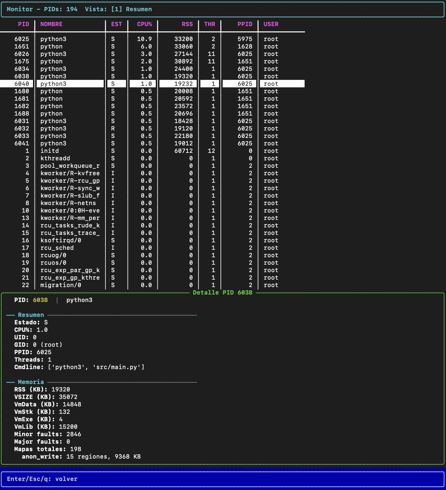
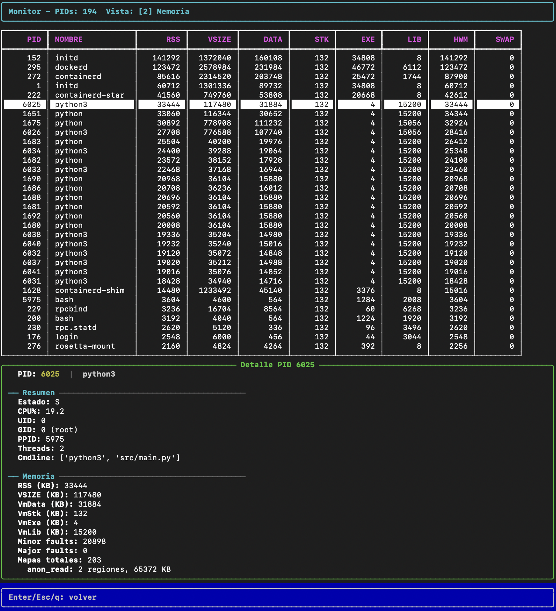
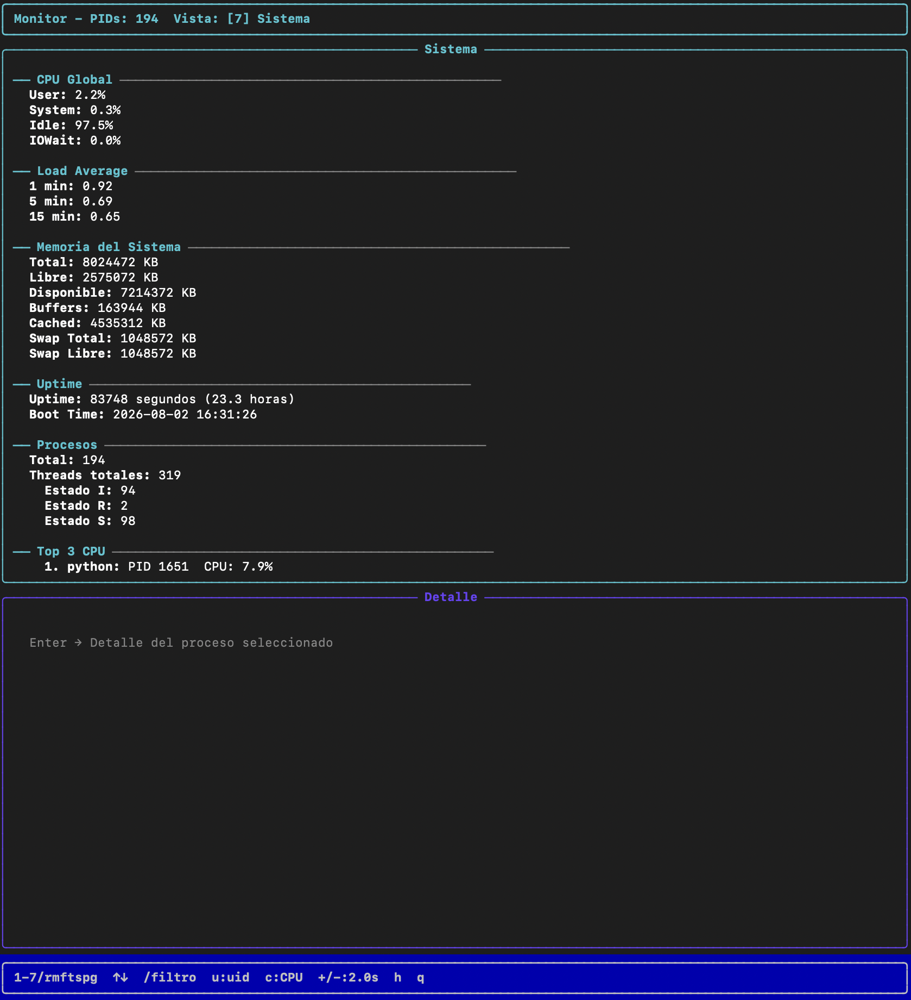

# Monitor de Procesos y Threads

**Computación II — Universidad de Mendoza — 2026**

Monitor del sistema en tiempo real inspirado en `htop`, construido con `multiprocessing` en Python. Lee `/proc` directamente (sin `psutil`) y muestra la anatomía interna de cada proceso con 7 vistas alternables.

---

## Descripción general

El monitor lee el filesystem `/proc` del kernel Linux para extraer información detallada de cada proceso: estado, memoria, file descriptors, threads, señales, scheduling y estadísticas globales del sistema.

**Funcionalidades principales:**

- 7 vistas alternables: Resumen, Memoria, FDs, Threads, Señales, Scheduling, Sistema
- Navegación con teclado (flechas, Enter, `/`, `u`, `c`, `+/-`)
- 7 procesos analizadores en paralelo, cada uno con su propio intervalo de refresco
- Señales: SIGINT/SIGTERM (shutdown), SIGHUP (reload config), SIGUSR1 (dump JSON), SIGUSR2 (verbose), SIGWINCH (repintar)
- Filtrado por usuario y por nombre de comando
- Ordenamiento por CPU%, RSS o PID

---

## Arquitectura

```
       ┌──────────────────────────────────────┐
       │           SNAPSHOT GLOBAL            │
       │      (Manager dict compartido)       │
       │  ┌─────────────────────────────────┐ │
       │  │ "resumen"   : {...}  ts: ...    │ │
       │  │ "memoria"   : {...}  ts: ...    │ │
       │  │ "fds"       : {...}  ts: ...    │ │
       │  │ "threads"   : {...}  ts: ...    │ │
       │  │ "senales"   : {...}  ts: ...    │ │
       │  │ "scheduling": {...}  ts: ...    │ │
       │  │ "sistema"   : {...}  ts: ...    │ │
       │  └─────────────────────────────────┘ │
       └────────▲─────────────────────▲───────┘
                │ escriben            │ lee
   ┌────────────┼─────────┬──────────┴────────┐
   │            │         │                    │
┌──▼──────┐ ┌───▼─────┐ ┌─▼──────┐  ...  ┌────▼─────┐
│Resumen  │ │Memoria  │ │FDs     │       │ Display  │
│cada 2s  │ │cada 3s  │ │cada 5s │       │ TUI      │
└─────────┘ └─────────┘ └────────┘       │ (vista   │
                                          │ activa)  │
   7 analizadores en paralelo,            └──────────┘
   cada uno con su propio ritmo
```

### Componentes

| Componente | Archivo | Responsabilidad |
|------------|---------|-----------------|
| **Entry point** | `src/main.py` | Inicializa Manager, lanza procesos, maneja loop principal con teclado y señales |
| **Recolector** | `src/recolector.py` | Lista PIDs desde `/proc` y los escribe al snapshot |
| **Resumen** | `src/analizadores/resumen.py` | Nombre, estado, PPID, UID/usuario, CPU%, threads, cmdline |
| **Memoria** | `src/analizadores/memoria.py` | RSS, VmSize, VmHWM, VmSwap, page faults, maps |
| **FDs** | `src/analizadores/fds.py` | File descriptors abiertos con tipo inferido (tty/socket/pipe/file) |
| **Threads** | `src/analizadores/threads.py` | LWPs, estado, CPU% por thread |
| **Señales** | `src/analizadores/senales.py` | SigBlk, SigIgn, SigCgt, SigPnd, ShdPnd decodificados |
| **Scheduling** | `src/analizadores/scheduling.py` | Nice, priority, policy, affinity, context switches, utime/stime |
| **Sistema** | `src/analizadores/sistema.py` | CPU global, loadavg, meminfo, Top 3 CPU/mem, procesos por estado |
| **Display** | `src/display.py` | 7 vistas TUI con Rich (Layout, Table, Panel, Text) |
| **Señales** | `src/senales.py` | Self-pipe pattern para manejo async-signal-safe |
| **Teclado** | `src/keyboard.py` | Raw mode + os.read() para input no bloqueante |
| **Procfs** | `src/procfs.py` | 16 funciones de parseo de `/proc` |

### Comunicación entre procesos

- **Snapshot global**: `Manager.dict()` compartido entre todos los procesos. Cada analizador escribe su sección (`snapshot['resumen']`, `snapshot['memoria']`, etc.) y el display lo lee directamente.
- **Intervalos**: `multiprocessing.Value('d')` por analizador. El display los modifica con `+`/`-` y los analizadores leen el valor en cada ciclo.
- **Shutdown**: `multiprocessing.Event()`. El loop principal lo setea y cada analizador lo consulta con `wait(timeout=intervalo)`.
- **Señales**: Self-pipe pattern — el handler escribe 1 byte al pipe, el loop principal lee con `select.select()` y despacha la acción correspondiente.

---

## Decisiones de diseño

### ¿Por qué `Manager.dict()` y no `Value`/`Array`?

El snapshot tiene estructura de diccionario anidado con datos de tipo variable (listas, dicts, strings, floats). `Value` y `Array` solo funcionan para tipos simples (int, float, bytes). `Manager.dict()` permite estructuras complejas y es serializado por un proceso server, lo que garantiza atomicidad a nivel de escritura de cada clave.

Para los intervalos, que son un solo float, usamos `multiprocessing.Value('d')` — más eficiente que pasar por Manager para un solo valor.

### ¿Por qué no Lock en el snapshot?

Las race conditions en este caso son benignas: si el display lee `snapshot['resumen']` mientras el analizador de memoria está escribiendo `snapshot['memoria']`, no hay conflicto porque cada proceso escribe una clave diferente. El peor caso es leer datos de un ciclo anterior, que es aceptable en un monitor de tiempo real. Un Lock serializaría innecesariamente 7 procesos.

### ¿Por qué self-pipe para señales?

Los handlers de señales en Python solo pueden ejecutar código async-signal-safe (pocas funciones de la stdlib). El patrón self-pipe permite: (1) el handler solo escribe 1 byte al pipe, (2) el loop principal detecta el byte con `select.select()` y ejecuta la lógica completa (relee config, hace dump, etc.) de forma segura.

### ¿Por qué `os.read()` en vez de `input()` para teclado?

`input()` lee línea completa (bloquea hasta Enter). Para una TUI que necesita responder a flechas y teclas individuales, usamos `os.read(fd, 1)` en raw mode, que lee bytes sin bloquear y permite detectar secuencias de escape de las flechas (`\x1bOA`, `\x1bOB`, etc.).

### ¿Por qué intervalos diferentes por vista?

Cada analizador tiene un intervalo propio (definido por defecto en `config.json` y ajustable en vivo con `+`/`-`). Los valores se eligieron según **cuán volátil es el dato** y **cuánto cuesta leerlo**:

| Vista | Intervalo | Justificación |
|-------|-----------|---------------|
| Resumen, Threads, Sistema | 2s | Datos que cambian constantemente (CPU%, estado, RSS, load) — necesitan refresco frecuente para ser útiles |
| Memoria | 3s | Vm\* y maps cambian más lento que el CPU% pero se muestran activos |
| FDs | 5s | Es el analizador más costoso (listar y readlink de todos los symlinks) — menos frecuencia |
| Señales, Scheduling | 10s | Máscaras de señales y políticas de scheduling son casi estáticas — apenas cambian, no justifican refrescar cada segundo |

Además, cada analizador es un **proceso separado**, así que los intervalos son **independientes**: uno lento no frena a los demás (si fueran threads, el GIL los encadenaría). El piso de cada uno lo define `VIEW_MIN` en `main.py` (evita que con `-` se baje el intervalo a valores que saturarían el sistema leyendo `/proc` sin parar) y el tope es 10s.

---

## Conceptos del curso aplicados

### Clase 3-4: Procesos, /proc, fork, exec, wait

- Todo el proyecto se basa en leer `/proc` para inspeccionar procesos desde fuera
- El PID y PPID se obtienen del nombre del directorio `/proc/<pid>/` y del campo `PPid` en `/proc/<pid>/status`
- Los zombies (estado Z) se detectan en la vista Sistema contando procesos por estado (`sistema.py:43-47`): para cada PID se lee el campo 3 de `/proc/<pid>/stat` (`state`, definido en `procfs.py:54`) y se agrupa por estado. Este concepto se vio en la clase 4 (fork, exec, wait): un zombie es un proceso terminado cuyo padre todavía no llamó a `wait()`, y el kernel conserva su entrada en la tabla de procesos solo para entregar el código de salida
- El `fork()` ocurre internamente al hacer `p = multiprocessing.Process(target=...)` y `p.start()` — el proceso hijo es el analizador, el padre sigue ejecutando el loop principal

### Clase 5: File descriptors, pipes

- `/proc/<pid>/fd/` muestra los file descriptors abiertos de cada proceso
- Los pipes anónimos se ven como `pipe:[inode]` en los symlinks
- El self-pipe pattern usa un pipe real (`os.pipe()`) para comunicación async-signal-safe
- `stdin`/`stdout`/`stderr` (FDs 0, 1, 2) se ven como `/dev/pts/N` o `/dev/null`

### Clase 6: Señales

- `signal.signal()` registra handlers para SIGINT, SIGTERM, SIGHUP, SIGUSR1, SIGUSR2
- El self-pipe es el patrón recomendado para manejar señales sin bloquear el loop principal
- Las señales se decodifican de máscaras hexadecimales (`SigBlk`, `SigIgn`, `SigCgt`) a nombres legibles
- `SIGWINCH` se captura para repintar al redimensionar la terminal

### Clase 7: mmap y memoria compartida

- `Manager.dict()` usa un proceso server con sockets internos para serializar datos entre procesos
- `multiprocessing.Value('d')` usa memoria compartida `mmap` internamente para un solo float

### Clase 8-9: Multiprocessing

- Cada analizador es un `multiprocessing.Process` con su propio `target` (loop infinito)
- `multiprocessing.Event()` coordina el shutdown entre procesos
- `fork` es el default en Linux: el hijo recibe el proxy del Manager y accede al snapshot compartido, pero cada analizador escribe su propia clave
- El display corre en el proceso principal para tener acceso directo al terminal

### Clase 10: Threading, GIL

- El teclado usa `os.read()` en raw mode (no threads) para simplicidad
- El GIL no afecta porque usamos `multiprocessing`, no `threading.Thread`
- Cada thread en `/proc/<pid>/task/<tid>/` se analiza en la vista Threads

### Clase 11: Sincronización

- No usamos Lock porque las race conditions son benignas: cada analizador escribe una clave diferente del snapshot
- `Event.wait(timeout=)` es la primitiva de sincronización para shutdown
- Los `Value` para intervalos se modifican desde el display y se leen desde los analizadores — race condition benigna (el peor caso es un ciclo con el valor anterior)

### Mapeo concepto → código

| Concepto | Dónde está en el código |
|----------|--------------------------|
| CPU% por delta de jiffies | `resumen.py:24-31` — `prev[pid]` se siembra siempre, fuera del `if` |
| Zombies (estado Z) | `sistema.py:43-47` agrupando el campo `state` de `/proc/<pid>/stat` |
| PID vs TID (LWP) | `threads.py:17-22` — doble loop sobre `/proc/<pid>/task/`; el hilo principal cumple `tid == pid` (`procfs.py:192`) |
| Context switches vol/invol | `scheduling.py:30-31` — `voluntary_ctxt_switches` / `nonvoluntary_ctxt_switches` |
| Decodificación de máscaras de señales | `analizadores/senales.py:18-27` — `mask & (1 << bit)` con bit N = señal N+1 |
| Self-pipe (async-signal-safe) | `src/senales.py:10-21` — el handler solo hace `os.write`; la acción corre en el loop principal |
| Manager.dict y serialización | `main.py:69-71` — proceso server + proxies |
| Race condition TOCTOU | `procfs.py:36` — `except (FileNotFoundError, PermissionError)` ante un proceso que murió entre listar y abrir |
| Memoria virtual (text/data/heap/stack) | `procfs.py:267-291` (`leer_maps`) + agrupación por permisos en `display.py` |
| jiffies → segundos | `procfs.py:7-9` (`clk_tck`) |

---

## Limitaciones conocidas

1. **No persiste datos**: el monitor no guarda historial — al cerrar se pierden todos los datos
2. **Race conditions benignas**: no se garantiza consistencia instantánea entre vistas (puede haber hasta 1 ciclo de diferencia). La race interna entre nuestros procesos está eliminada por diseño (cada proceso escribe una clave distinta del snapshot), pero la externa no se puede prevenir: un thread puede morir entre que lo listamos en `/proc/<pid>/task/` y que leemos su `/proc/<pid>/task/<tid>/stat`. Se tolera con `try/except (FileNotFoundError, PermissionError)` que devuelve `None` y la vista muestra `?`
3. **Docker required**: solo funciona en Linux (resuelto con Docker en macOS)
4. **Sin control de acceso**: corre como root en Docker y muestra todos los procesos del sistema sin filtro de permisos
5. **FDs no sigue symlinks**: muestra el destino del symlink pero no resuelve archivos eliminados (deleted)
6. **Memoria compartida serializada**: `Manager.dict()` tiene overhead de serialización — no escala a miles de procesos sin degradación
7. **`c` (orden) es específico por vista**: la tecla `c` cicla CPU% → RSS → PID en la vista Resumen. En las vistas especializadas el orden está fijado a la métrica de identidad de cada una (Memoria ordena por RSS, FDs por cantidad, Threads por hilos, Señales y Scheduling por PID), porque ordenar por CPU% no tiene sentido sobre datos que no lo muestran

---

## Cómo correr

### Requisitos

- Docker Desktop (macOS/Linux/Windows con WSL2)
- docker compose v2
- make

### Targets del Makefile

| Target | Comando | Qué hace |
|--------|---------|----------|
| `run` | `docker compose up --build` | Construye y levanta el contenedor con el monitor como proceso principal (modo entrega) |
| `dev` | `docker compose run --rm -it --name tp1-test monitor bash` | Contenedor interactivo `tp1-test` sin auto-lanzar el monitor: para probar la TUI con tu teclado |
| `exec` | `docker compose exec monitor bash` | Entra a un bash dentro del contenedor del servicio (`tp1-monitor-1`), requiere que esté corriendo |
| `stop` | `docker compose down` | Detiene y elimina el contenedor |

### Ejecución

**Entrega (modo oficial de la consigna):** un solo comando levanta todo.

```bash
make run
```

El Dockerfile define `CMD ["python", "src/main.py"]`, así que el monitor arranca como proceso principal del contenedor y muestra la TUI.

**Desarrollo / testeo interactivo:** `docker compose run` crea un contenedor limpio (`tp1-test`) que *no* lanza el monitor, para manejarlo con el teclado local:

```bash
# Terminal 1 — contenedor y monitor interactivo:
make dev                 # bash dentro del contenedor tp1-test (pid: host)
python3 src/main.py      # el monitor, con tu teclado

# Terminal 2 — señales y procesos de prueba contra ese monitor:
docker exec tp1-test sh -c 'kill -USR1 <PID>'
```

> El contenedor corre con `pid: host`, así que el monitor ve y analiza los procesos reales del sistema. Probá siempre con `make dev` y no con `make run` + `make exec`: como `make run` ya lanza el monitor como proceso principal, levantar otro con `make exec` deja **dos monitores** y las señales se vuelven ambiguas (y el monitor del contenedor no se puede terminar sin detener el contenedor).

### Keybindings

| Tecla | Acción |
|-------|--------|
| `1`-`7` / `r/m/f/t/s/p/g` | Cambiar vista |
| `↑` `↓` | Navegar procesos |
| `Enter` | Pin proceso seleccionado |
| `/` | Filtrar por nombre |
| `u` | Filtrar por usuario (UID) |
| `c` | Ciclar orden (CPU% → RSS → PID) |
| `+` / `-` | Ajustar intervalo vista activa |
| `q` | Salir |
| `h` / `?` | Ayuda |

### Señales

El monitor corre como proceso `python3 src/main.py` dentro del contenedor `tp1-test`. Su PID se ve en la vista Resumen (el proceso `python src/main.py`) o se obtiene así:

```bash
docker exec tp1-test python3 -c "import os; [print(p) for p in sorted(os.listdir('/proc')) if p.isdigit() and 'main.py' in open(f'/proc/{p}/cmdline','rb').read().decode(errors='ignore')]"
```

| Señal | Comando | Efecto |
|-------|---------|--------|
| SIGHUP | `docker exec tp1-test sh -c 'kill -HUP <PID>'` | Recarga `config.json` |
| SIGUSR1 | `docker exec tp1-test sh -c 'kill -USR1 <PID>'` | Dump del snapshot a `dump_<timestamp>.json` |
| SIGUSR2 | `docker exec tp1-test sh -c 'kill -USR2 <PID>'` | Toggle modo verbose (más FDs y threads en el detalle; se ve `VERBOSE` en pantalla) |
| SIGINT / SIGTERM | `docker exec tp1-test sh -c 'kill -TERM <PID>'` | Shutdown limpio (termina los analizadores) |

> Se usa `sh -c 'kill ...'` porque el contenedor slim no trae el binario `kill` (el shell `dash` sí lo trae como builtin). No se usa `kill -HUP 1`: el contenedor corre con `pid: host`, comparte el namespace de PIDs del host, así que el PID 1 es el init del sistema, no el monitor.

### Testear

Verificación del parseo de `/proc` sin levantar la TUI (dentro del contenedor):

```bash
make dev   # entrás al bash del contenedor tp1-test y ahí:
cd src                                                                    # los módulos están en src/
python3 -c "import procfs; print(procfs.leer_status(1)['Name'])"                    # el nombre del proceso 1
python3 -c "import procfs; print(len(procfs.listar_pids()))"                         # cantidad de procesos
python3 -c "import analizadores.senales as s; print(s.decodificar_mascara('0000000000000002'))"  # ['SIGINT']
```

Checklist funcional del monitor:

- [ ] Levantá el monitor y verificá las 7 vistas (`1`-`7` o `r/m/f/t/s/p/g`)
- [ ] Navegá con `↑`/`↓` y abrí el detalle de un proceso con `Enter` (cierra con Enter/Esc/q)
- [ ] Filtrá por nombre con `/`, por UID con `u`; cancelá con `ESC`
- [ ] Cambiá el orden con `c` (CPU% → RSS → PID) y el intervalo de la vista activa con `+`/`-`
- [ ] `q` sale limpiamente y restaura la terminal

Prueba de señales (segunda terminal):

```bash
docker exec tp1-test python3 -c "import os; [print(p) for p in sorted(os.listdir('/proc')) if p.isdigit() and 'main.py' in open(f'/proc/{p}/cmdline','rb').read().decode(errors='ignore')]"   # PID del monitor
docker exec tp1-test sh -c 'kill -HUP  <PID>'   # recarga config.json (verificable cambiando un intervalo del archivo)
docker exec tp1-test sh -c 'kill -USR1 <PID>'   # genera dump_<timestamp>.json en el directorio actual
docker exec tp1-test sh -c 'kill -USR2 <PID>'   # toggle verbose (más FDs/threads en el detalle)
docker exec tp1-test sh -c 'kill -TERM <PID>'   # shutdown limpio
```

> No hay tests automatizados (los unit tests del parseo de `/proc` son opcionales en el enunciado); la verificación es manual con los pasos de arriba.

### Archivos

- `config.json`: intervalos por vista (recolector, resumen, memoria, fds, threads, senales, scheduling, sistema)
- Los dumps se generan como `dump_<timestamp>.json` en el directorio actual

---

## Decisiones sobre la TUI

Elegí **Rich** y no `curses` por:

- **Composición declarativa**: `Layout`, `Table`, `Panel` y `Text` son renderables que se componen y se actualizan por zonas (`layout['table'].update(...)`), en vez de dibujar caracteres celda por celda como exige curses.
- **`Live` con `refresh_per_second=4`**: el loop principal actualiza solo los renderables que cambiaron y Rich redibuja; curses obliga a manejar el repintado a mano.
- **`screen=True`**: usa el alternate screen buffer de la terminal (como vim/htop): al salir se restaura el contenido anterior. Con curses habría que implementarlo manualmente.
- **Estilo rápido**: `border_style`, `style='bold white on blue'`, etc., sin trackear atributos de color a mano.

Como contra, Rich agrega overhead de renderizado — irrelevante a 4fps para una lista de procesos.

## Capturas de pantalla







## Lo que aprendiste

Hasta este TP, los procesos eran un concepto teórico de la materia. Al tener que leer `/proc` a mano — parsear el `stat` posicional, el `cmdline` separado por NUL, las máscaras hex de señales — me di cuenta de que el "estado de un proceso" no es una abstracción: es un montón de archivos de texto que el kernel mantiene vivos, y que pueden desaparecer en el medio de una lectura (TOCTOU). Aprender a defender esas lecturas con `try/except`, y entender por qué un `os.path.exists()` previo no arregla nada, fue uno de esos momentos de "ah, ahora entiendo".

La segunda revelación fue el `multiprocessing` real: cada analizador es un proceso de verdad, con su memoria separada. Ver que un `dict` normal no se comparte entre `fork`s (y que por eso existe `Manager`) hizo clic con la clase de memoria compartida y Copy-on-Write. Lo mismo con el self-pipe: entender que un handler de señal no puede ejecutar casi nada y que la solución es escribir un byte a un pipe fue aplicar la clase 6 en serio.

Si tuviera que hacerlo de nuevo, arrancaría antes la arquitectura de procesos y no la dejaría para el final, y agregaría tests del parseo de `/proc`. Pero el proceso de debugging (procesos huérfanos, terminal que no se restaura, datos que no se actualizaban) me enseñó más que cualquier tutorial.

---
